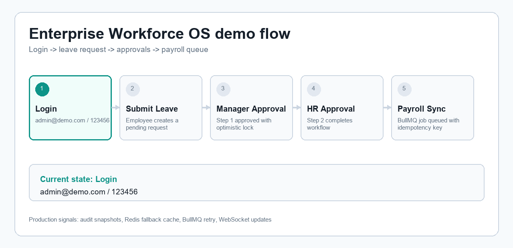
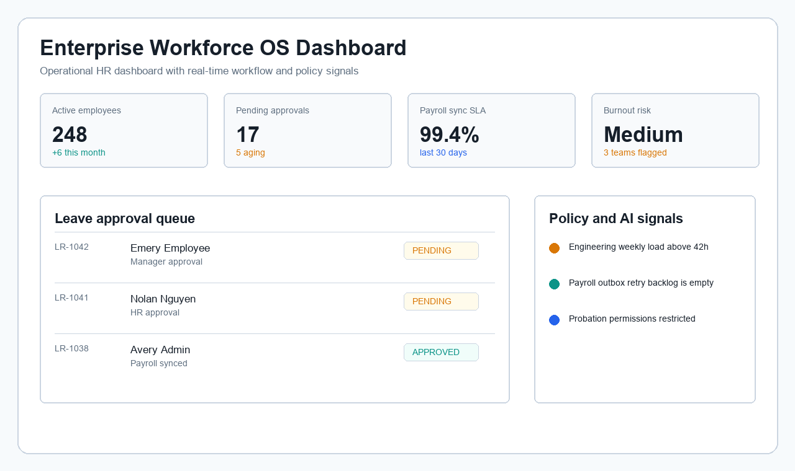
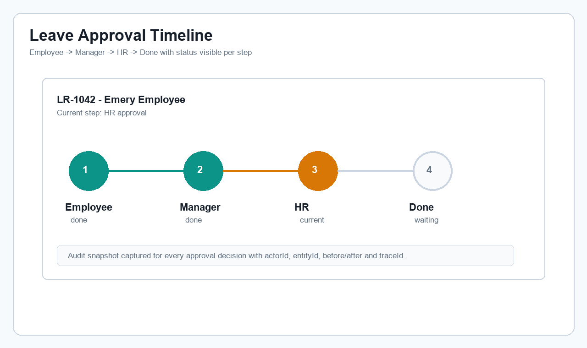
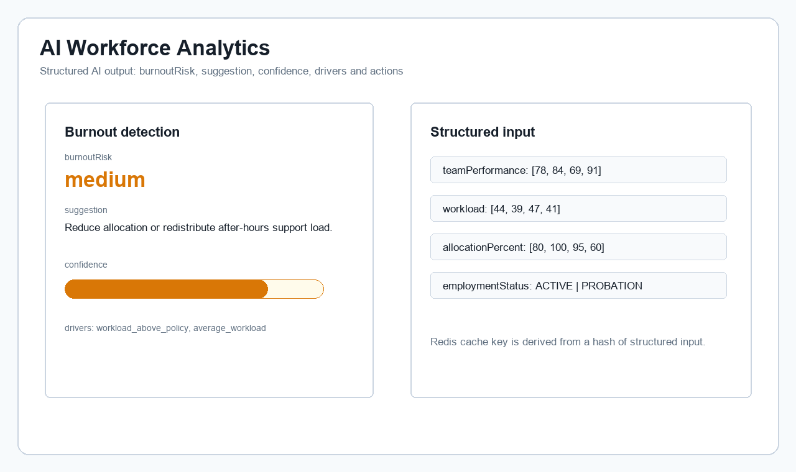

# Enterprise Workforce OS

Production-grade HRM/ERP workforce platform built as a full-stack monorepo.

This repo is intentionally not a CRUD demo. It shows enterprise workflow design: two-step leave approval, immutable salary history, audit snapshots, Redis caching/rate limiting, BullMQ background jobs, WebSocket notifications, and AI insights based on workforce context.

## Quick Demo

```bash
pnpm install
pnpm db:push
pnpm db:seed
pnpm dev
```

If `pnpm` is not available yet:

```bash
corepack enable
corepack prepare pnpm@10.12.1 --activate
```

Then open:

- Web: `http://localhost:3000`
- API: `http://localhost:4000`

Demo accounts:

| Role | Email | Password |
| --- | --- | --- |
| Admin | `admin@demo.com` | `123456` |
| HR | `hr@demo.com` | `123456` |

## Run Full Stack Locally

```bash
docker compose up -d postgres redis
pnpm install
pnpm db:push
pnpm db:seed
pnpm dev
```

## Run With Docker

```bash
docker compose up --build
```

The API container runs `db:push` and `db:seed` before starting, so a fresh Docker demo has schema and demo users without extra manual steps.

## What To Review First

1. [System design](./docs/system-design.md)
2. [Use cases](./docs/USE_CASES.md)
3. [Failure handling](./docs/FAILURE_HANDLING.md)
4. [Scaling strategy](./docs/SCALING.md)
5. Demo flow: 

## Screenshots

### Dashboard



### Approval Timeline



### Analytics



## Demo Flow

1. Login as HR with `hr@demo.com / 123456`.
2. Review pending leave requests on the dashboard.
3. Create or inspect a leave request in `PENDING` state.
4. Approve as Manager.
5. Approve as HR.
6. Confirm payroll sync is queued through BullMQ.
7. Review audit logs for actor, entity, before/after snapshots, timestamp, and trace ID.

## Monorepo

```text
apps/
  api/        NestJS API, workflows, queues, WebSocket gateway
  web/        Next.js App Router dashboard
packages/
  database/   Prisma 7 schema, client, seed
  shared/     Zod schemas and DTO contracts
  ui/         Shared UI primitives
  config/     TypeScript and ESLint config
```

## Quality Gates

```bash
pnpm lint
pnpm test
pnpm build
```
