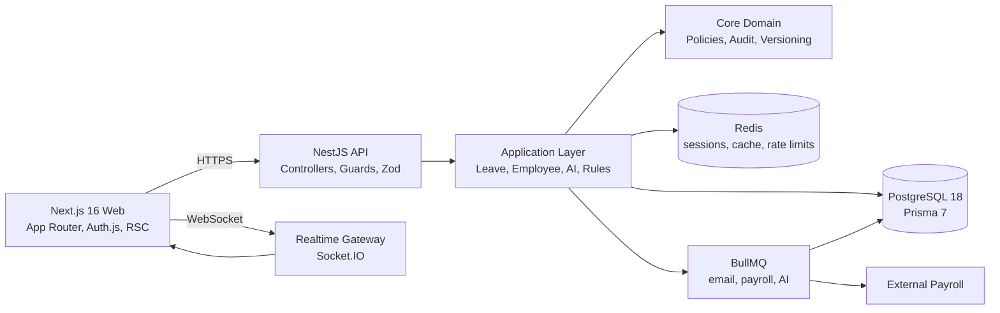
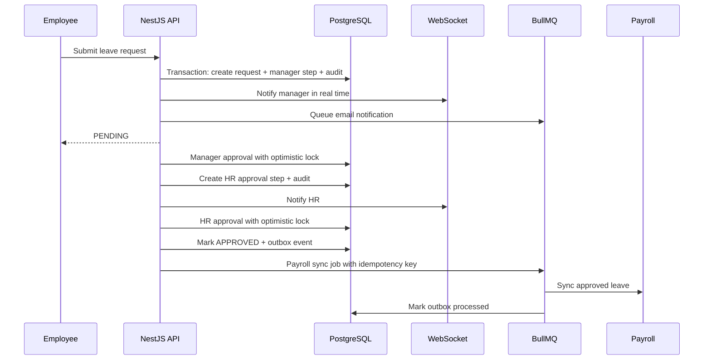

# System Design

## Architecture Diagram



```text
+------------------+       +------------------+
| Next.js Web      | ----> | NestJS API       |
| Dashboard/Auth   |       | RBAC/Zod/TraceId |
+---------+--------+       +----+--------+----+
          |                     |        |
          | WebSocket           |        |
          v                     v        v
   +-------------+       +-----------+  +-----------+
   | Realtime    |       | Postgres  |  | Redis     |
   | Gateway     |       | source of |  | cache/rate|
   +-------------+       | truth     |  | sessions  |
                         +-----+-----+  +-----+-----+
                               |              |
                               v              v
                         +-------------------------+
                         | BullMQ workers          |
                         | email/payroll/AI        |
                         +-------------------------+
```

## Leave Approval Sequence



## Why Redis?

We use Redis for:

- Caching frequently accessed queries, such as employee lists and AI results.
- Session lookup acceleration after JWT validation.
- Rate limiting login, API, and AI endpoints.
- BullMQ coordination and delayed retry state.

Trade-off:

- Increased infrastructure complexity.
- Cache invalidation must be explicit.
- Redis cannot be treated as source of truth.

Design decision:

- PostgreSQL remains authoritative.
- Redis failures degrade caching/rate-limit precision but do not block read paths.
- Critical workflow state is always committed in PostgreSQL transactions.

## Why Queue?

We use BullMQ for:

- Email notifications.
- Payroll sync.
- AI processing.

Trade-off:

- Users may see eventual consistency for external systems.
- Workers must be monitored separately from the API.
- Failed jobs need retry and dead-letter review.

Design decision:

- API requests commit workflow state first.
- External effects are represented by outbox events and idempotency keys.
- Workers retry with exponential backoff.

## Why PostgreSQL + Prisma?

PostgreSQL is used for transactional data that must not be lost or overwritten: employees, salary history, leave workflow state, audit logs, outbox events, and feature flags.

Prisma 7 gives typed data access while still letting the architecture keep business workflows in application services instead of controllers.

Trade-off:

- ORM migrations must be reviewed carefully.
- Complex reporting may require SQL views or raw SQL later.

## Why Optimistic Locking?

Approvals and salary changes are human workflows where two actors may edit the same record. Each critical model carries a `version` column. Updates include the expected version, and conflicting updates fail with `409 Conflict`.

This avoids silent overwrite while keeping the system horizontally scalable.

## Audit Strategy

Sensitive writes create audit rows with:

- `actorUserId`
- `entityType`
- `entityId`
- `action`
- `beforeSnapshot`
- `afterSnapshot`
- `traceId`
- timestamp

This makes salary, employee, and leave changes explainable during HR, finance, or compliance review.

## AI Contract

AI requests are not free-form text prompts. The service builds structured context from database facts:

```ts
type WorkforceAiInput = {
  teamPerformance: number[];
  workload: number[];
  team: Array<{
    employeeId: string;
    employmentStatus: string;
    performanceScore: number;
    weeklyHours: number;
    allocationPercent: number;
  }>;
};
```

AI output is also structured:

```ts
type WorkforceAiOutput = {
  burnoutRisk: "low" | "medium" | "high";
  suggestion: string;
  confidence: number;
  drivers: Array<{ signal: string; employeeId?: string; value: number | string }>;
  actions: string[];
};
```

The input is hashed and cached in Redis. The database also stores the structured input, result, model label, creator, and expiration so repeated analysis is explainable.

Trade-off:

- Structured outputs are less flexible than arbitrary prose.
- They are easier to validate, cache, test, and display in product UI.
